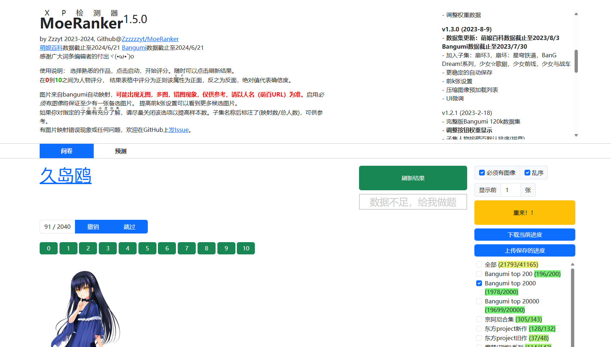

> 当前正在浏览归档文件。若需要返回索引，请[点击此处](/archives/)


> ```
> 难度系数：学会了就不难
> ```
>
> 上一题我们了解了简单框架 vitepress , 现在我们学习热门的Vue框架。
>
> Vue是一个易学易用，性能出色，适用场景丰富的 渐进式 JavaScript 框架, 在本体中, 我们将学习Vue, 并利用他完成一些简单的小项目。

## **故事背景：**

Muramasa最近在和朋友玩一个属性检测器, 其原理是根据给角色的打分数据, 分析出你对各个属性的喜爱程度。

> 

然而, 这上面的二次元浓度过重, 不是二次元的Muramasa难以承受, 他想请你做一个类似的网站,  实现这个打分功能, 还能顺便加深对Vue的理解, 岂不美哉。

## **任务：**

- 学习Vue

- 创建一个Vue项目

  > 注意, 这里需要你创建一个Vue项目, 而不是在js文件中引入Vue
  >
  > (上网搜搜创建Vue项目的教程)

- 编写一个打分软件, 包含以下功能:

  - 打分区: 在这里可以对出现的图像进行打分, 一个图像打完分后会出现下一个图像, 直到对所有图像完成评分。
  - 显示区: 此处会展示你已打分的图像和你的评分

- 要求依次打分, 显示评分的功能尽量用Vue的语句实现, 不要在Vue项目里写三件套的代码。

- 附加(不做要求, 但是鼓励尝试): 

  - 可以尝试一下引入网上的组件库
  - 做一些附加功能: 如可以效仿题目背景中的网站, 利用打分的数据做一些分析, 而不是仅仅展示出来; 或者可以不仅仅是打分, 还包含了评论功能。你也可以添加一些自己想要的附加功能, 越有技术含量越好!

- 最后, 将你的vue项目上传到github仓库中, 提交给我们。

> 注: 对图像的内容没有要求, 可以是游戏, 二次元, 或是人物, 体育赛事等主题的打分。

## **博客参考：** 

- [Vue.js](https://cn.vuejs.org/)(官方文档)
- [尚硅谷Vue2.0+Vue3.0全套教程](https://www.bilibili.com/video/BV1Zy4y1K7SH)
- [黑马程序员Vue2+Vue3教程](https://www.bilibili.com/video/BV1HV4y1a7n4)

## **本题提交方式**

> [ 提交点这里 ](https://www.runoob.com/html/html-tutorial.html)

## **出题者Q&A方式**

> QQ：1017327044