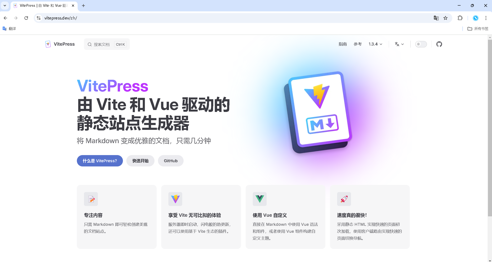

> 当前正在浏览归档文件。若需要返回索引，请[点击此处](/archives/)

> ```
> 难度系数：竟然是轻松耶
> ```
>
>前面的题目相信对你来说还挺麻烦的，但这道题就比较轻松了，
>
>你可以使用这个名叫VitePress的框架，搭建你自己的知识博客。
>

## **前置知识**

Node.js,  Markdown

## **任务**

简单做一个长相酷似做题网站的个人博客，并部署VitePress站点
>
>


## **攻略**

- [VitePress官方文档](https://vitepress.dev/zh/guide/deploy)
- [B站教学视频](https://www.bilibili.com/video/BV1XW4y1w7bc/?spm_id_from=333.337.search-card.all.click&vd_source=4da8e877232fe6517d8e86ba27e7fc11)

## **可能遇到的问题**

- 命令行怎么使用？
- 路由是什么？
- 如何部署？直接部署到GitHub？买个服务器部署着玩玩？

## **本题提交方式**

> [ 提交点这里 ](https://www.runoob.com/html/html-tutorial.html)
>
>
> 记得新建个仓库存放

## **出题者Q&A方式**

> QQ：3062803169